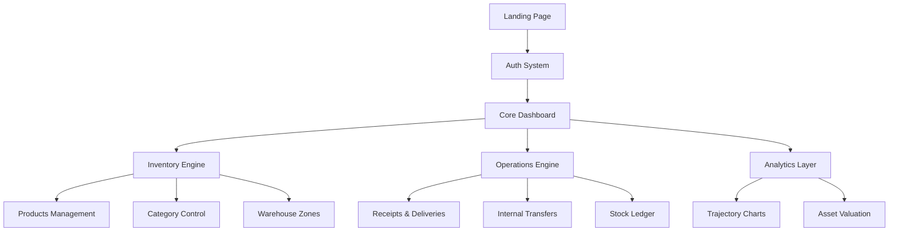

# CoreInventory | Precision Intelligence

CoreInventory is a high-performance, real-time inventory management system designed for operational excellence. It provides warehouse teams with complete visibility over stock levels, transfers, and deliveries through a premium, data-driven interface.

---

## 🚀 Key Features

### 📦 Inventory Control
- **Real-Time Stock Tracking**: Monitor inventory levels across all locations with sub-2-second sync latency.
- **Multi-Warehouse Management**: Unified visibility for multiple distribution hubs and zones.
- **Low Stock Alerts**: Predictive notifications to prevent stockouts.

### 📊 Intelligence & Audit
- **Precision Analytics**: Data-driven insights into inventory value trajectory and stock accuracy.
- **Immutable Audit Ledger**: Complete cryptographic trail of every inventory movement.
- **Stock Ledger**: Detailed history of every transaction for full accountability.

### 🇮🇳 Indian Localization
- **Local Currency**: Full **INR (₹)** support across the entire platform.
- **Regional Formatting**: Configured for Indian numbering systems (`en-IN`).
- **Privacy-Focused**: Generic profile icons instead of AI-generated avatars.

---

## 🛠️ Tech Stack

### Frontend
- **Framework**: [React 19](https://react.dev/) (Concurrent Rendering)
- **Styling**: [Tailwind CSS 4](https://tailwindcss.com/) (JIT Engine)
- **Animations**: [Framer Motion](https://www.framer.com/motion/) & [GSAP](https://greensock.com/gsap/) (GSAP for precise timeline control)
- **Icons**: [Lucide React](https://lucide.dev/)

### Data & State
- **State Management**: [Zustand](https://github.com/pmndrs/zustand) (Atomic state updates)
- **Tables**: [TanStack Table v8](https://tanstack.com/table) (Headless, efficient data handling)
- **Charts**: [Recharts](https://recharts.org/) (SVG-based responsive charts)
- **Dates**: [Day.js](https://day.js.org/) (Lightweight date manipulation)

---

## 🎨 Premium Experience

CoreInventory is built with a focus on high-end aesthetics and fluid user experience:
- **Custom Hardware-Accelerated Cursor**: Optimized for low latency and high-precision interaction.
- **Dark Mode by Default**: Sleek, professional interface optimized for operations centers.
- **Micro-interactions**: Subtle feedback loops and animations for enhanced usability.

---

## 📐 System Architecture



---

## 🔄 Operational Workflow

1. **Inbound (Receipts)**: Register incoming shipments from suppliers.
2. **Storage (Warehousing)**: Assign products to specific facilities and storage zones.
3. **Movement (Transfers)**: Seamlessly move stock between different facilities with tracked internal orders.
4. **Outbound (Deliveries)**: Process fulfillment orders to customers.
5. **Audit (Ledger)**: Automatically generate immutable records for every movement above.

---

## 📦 Getting Started

### Prerequisites
- Node.js (v18+)
- npm or yarn

### Installation

1. Clone the repository:
   ```bash
   git clone https://github.com/Parthtarpara/Codexa_CoreInventory.git
   ```
2. Install dependencies:
   ```bash
   npm install
   ```
3. Start the development server:
   ```bash
   npm run dev
   ```

---

## 📁 Project Structure

```text
src/
├── components/     # Reusable UI components & Layouts
├── data/           # Mock data and static user definitions
├── pages/          # Individual dashboard views & Landing Page
├── store/          # Zustand state definitions
├── utils/          # Formatters, helpers, and constants
└── assets/         # Global styles and static media
```

---
© 2025 CoreInventory | Built for Precision Operations
